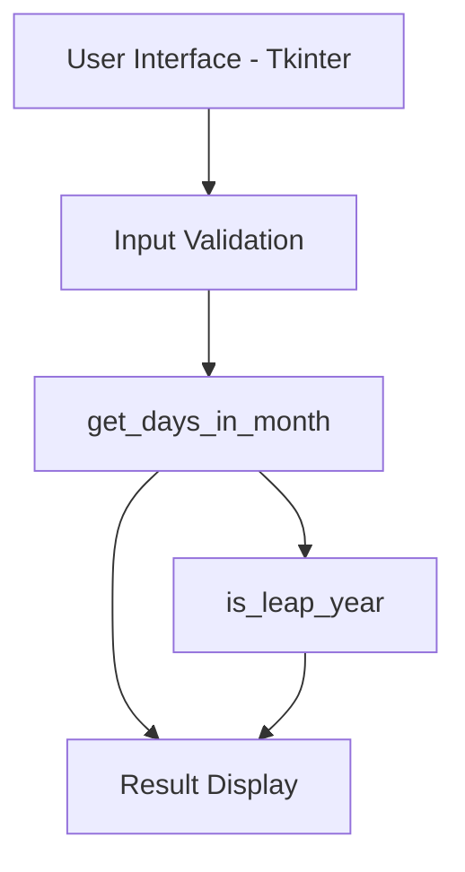
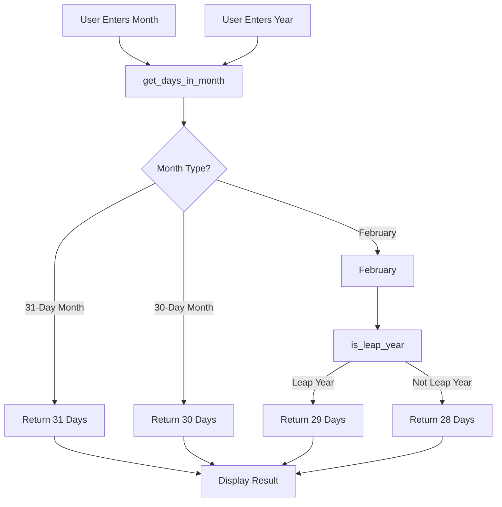
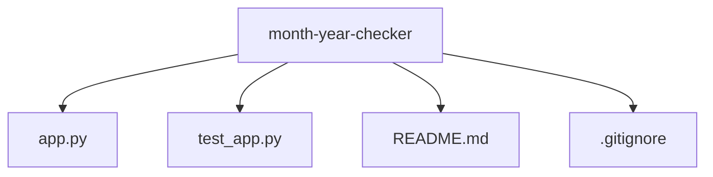
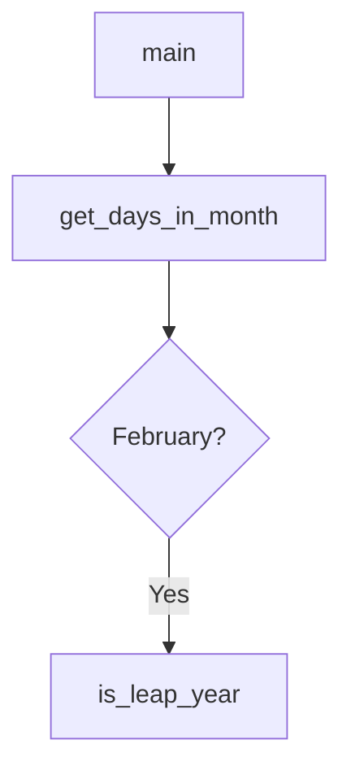

# Month-Year Checker

A Python application that calculates the number of days in a month and determines whether a year is a leap year.

## Features

- Leap year detection
- Days in month calculation
- Tkinter graphical interface
- Input validation
- Exception handling
- Unit tests
- Type hints
- Git version control

## Technology Stack

- Python 3
- Tkinter
- unittest
- Git
- GitHub

## Application Architecture



## Business Logic Flow



## Project Structure



## Function Relationships



## Testing Coverage

The unit tests verify:

- Leap year calculations
- Non-leap year calculations
- February day calculations
- 30-day month calculations
- 31-day month calculations
- Invalid month handling

## Run Application

```bash
python app.py
```

## Run Tests

```bash
python -m unittest test_app.py
```

## Future Enhancements

- Calendar view
- Export results to CSV
- Theme support (Dark Mode)
- Date calculations
- Packaging as a desktop executable


## Author

Vikram Raju K

```
